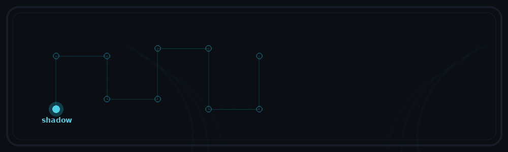
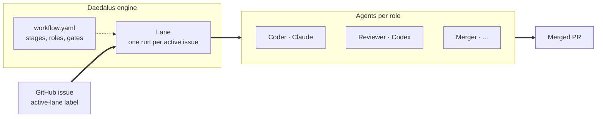

<div align="center">



<br>

**A Hermes Agent plugin 💠 Reads issues, writes PRs**

*Daedalus built the Labyrinth, gave Theseus the thread, and warned Icarus not to fly too close to the sun.*

*This one does all three.*

</div>

---

## What it is

Daedalus automates your **SDLC** with agents — driven by your GitHub issues. Label an issue and Daedalus walks it through your workflow: picks the right agent for each stage, tracks state, survives crashes, ships when done. The first workflow we ship is **Code-Review** (`Issue → Code → Review → Merge`). More are coming.

## Three myths, one engine

<table>
<tr>
<td width="33%" valign="top">

### 🧵 The thread

One owner per issue. A heartbeat keeps the thread taut. If the holder dies mid-flight, another instance picks it up on the next tick — work never gets dropped or duplicated.

→ [Leases & heartbeats](docs/concepts/leases.md)

</td>
<td width="33%" valign="top">

### 🌀 The labyrinth

Every issue walks a clear path through the workflow — picked, coded, reviewed, shipped. State is tracked, not guessed. You always know where each issue is and how it got there.

→ [Lanes](docs/concepts/lanes.md) · [Events](docs/concepts/events.md)

</td>
<td width="33%" valign="top">

### 🪶 The wings

Daedalus warned Icarus, then flew home. Edits take effect on the next tick. A bad edit doesn't crash the loop — it gets ignored until you fix it. Wedged workers clean up automatically.

→ [Hot-reload](docs/concepts/hot-reload.md) · [Stalls](docs/concepts/stalls.md)

</td>
</tr>
</table>

## What's in the box

- **Configurable agent per role.** Pick which agent and model handles each role in your workflow — Codex for review, Claude for code, your own agent for merge. Set in `workflow.yaml`.
- **Hot-reload.** Edit `workflow.yaml` and the next tick picks it up. Bad edits don't crash the loop; they get ignored until you fix them.
- **Stall detection.** Wedged agents get terminated automatically and the lane retries. No zombie workers.
- **Symphony-aligned event vocabulary** — events follow the [openai/symphony](https://github.com/openai/symphony) taxonomy, so observability tools work across systems.
- **Operator commands** — `/daedalus status`, `/daedalus doctor`, `/workflow code-review status`, `/workflow code-review tick`.
- **Live status dashboard** — ships separately as a Hermes-Agent watch plugin.

## Supported path

Daedalus is ready to publish on one explicit path:

- **Platform:** Linux
- **Install path:** `hermes plugins install attmous/daedalus --enable`
- **Plugin home after install:** `~/.hermes/plugins/daedalus`
- **Workflow root:** `~/.hermes/workflows/<owner>-<repo>-<workflow-type>`
- **Host Python:** `python3` with `yaml` and `jsonschema` available
- **24/7 supervision:** `systemd --user`
- **Runtime adapters:** whatever `workflow.yaml` names must exist on the host (`acpx-codex`, `claude-cli`, `hermes-agent`, ...).

If you want the exact operator contract we support, read [docs/public-contract.md](docs/public-contract.md).

## Install & quick start

```bash
# 1. Make sure host python has the runtime deps
# Debian/Ubuntu example:
sudo apt install python3-yaml python3-jsonschema

# 2. Install and enable the plugin
hermes plugins install attmous/daedalus --enable

# 3. Scaffold one workflow instance
hermes daedalus scaffold-workflow \
  --workflow-root ~/.hermes/workflows/your-org-your-repo-code-review \
  --github-slug your-org/your-repo
```

Edit `~/.hermes/workflows/your-org-your-repo-code-review/config/workflow.yaml` before starting the engine:

- set `repository.local-path`
- confirm the runtime kinds you actually have installed
- tune agents/models/gates for your repo

Then initialize, verify, and supervise it:

```bash
hermes daedalus init \
  --workflow-root ~/.hermes/workflows/your-org-your-repo-code-review

hermes daedalus doctor \
  --workflow-root ~/.hermes/workflows/your-org-your-repo-code-review \
  --format json

hermes daedalus service-install \
  --workflow-root ~/.hermes/workflows/your-org-your-repo-code-review \
  --service-mode active

hermes daedalus service-enable \
  --workflow-root ~/.hermes/workflows/your-org-your-repo-code-review \
  --service-mode active

hermes daedalus service-start \
  --workflow-root ~/.hermes/workflows/your-org-your-repo-code-review \
  --service-mode active
```

Start Hermes in your repo:

```bash
export DAEDALUS_WORKFLOW_ROOT=~/.hermes/workflows/your-org-your-repo-code-review
cd /path/to/your/repo
hermes
```

Inside Hermes:

```text

/daedalus status
/daedalus doctor
/workflow code-review status
```

The full supported install path is documented in [docs/operator/installation.md](docs/operator/installation.md).

Daedalus also ships a standard Hermes pip entry point. From a local checkout or
published package, Hermes can discover it through `hermes_agent.plugins`:

```bash
python3 -m pip install .
hermes plugins enable daedalus
```

The Git install path above remains the primary community path because it is the
most direct operator story and handles install + enable in one command.

Need a local-dev fallback instead of `hermes plugins install`?

```bash
git clone https://github.com/attmous/daedalus.git
cd daedalus
./scripts/install.sh --hermes-home /path/to/hermes-home    # custom Hermes home
./scripts/install.sh --destination /tmp/daedalus           # arbitrary destination
hermes plugins enable daedalus
```

`HERMES_ENABLE_PROJECT_PLUGINS=true` is only for project-local plugins under `./.hermes/plugins/`. It is not required for the supported global install path above.

The full operator surface is in the [cheat sheet](docs/operator/cheat-sheet.md); every slash command is catalogued in [slash-commands.md](docs/operator/slash-commands.md).

## How it fits together



A **labeled issue** is the trigger. The **engine** ticks; for every active issue, it spins up a **lane** — one run of the workflow defined in `workflow.yaml` — and dispatches to the **agent** configured for the current stage. Agents write commits, post review comments, and eventually merge. When the workflow's last gate clears, the PR closes the loop.

## Philosophy

- **State is tracked, not guessed.** The workflow always knows where each issue stands.
- **A bad edit in the workflow.yaml doesn't crash anything.** It just gets ignored until you fix it.
- **Recovery is automatic.** Lost workers never block forward motion.
- **No packaging theater.** This is a plugin payload — flat top level, on purpose.
- **`--json` is the default operator dialect.** Humans read formatters, scripts read JSON.

## Documentation

- **[docs/architecture.md](docs/architecture.md)** — the big picture, end to end.
- **[docs/operator/installation.md](docs/operator/installation.md)** — the supported install, scaffold, verify, and supervise path.
- **[docs/public-contract.md](docs/public-contract.md)** — the stability boundary for the first public release.
- **[docs/symphony-conformance.md](docs/symphony-conformance.md)** — what is already Symphony-aligned, what is only partial, and what is still missing.
- **[docs/security.md](docs/security.md)** — the trust model, shell/runtime posture, and secret-handling expectations.
- **[docs/concepts/](docs/concepts/)** — short explainers for each moving part: lanes, leases, runtimes, events, hot-reload, stalls.
- **[docs/operator/](docs/operator/)** — day-to-day commands, the operator cheat sheet, the full slash-command catalogue.

## License

MIT — see [LICENSE](LICENSE).

<div align="center">
<sub>Daedalus is a Hermes plugin. Hermes is the messenger; Daedalus is the loom.</sub>
</div>
