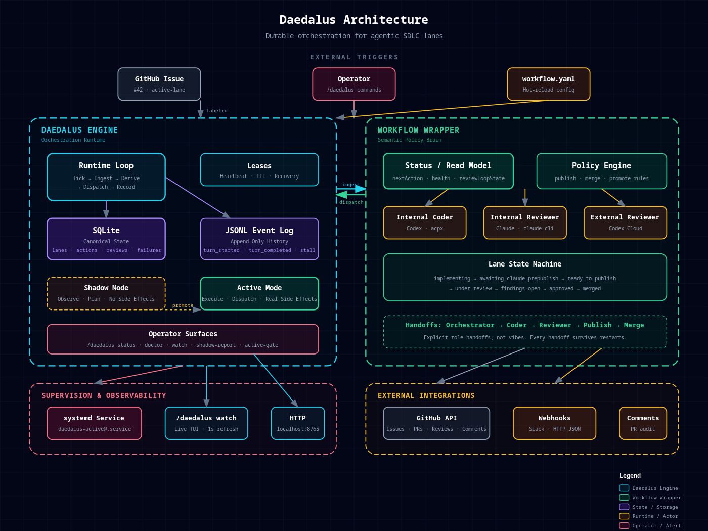
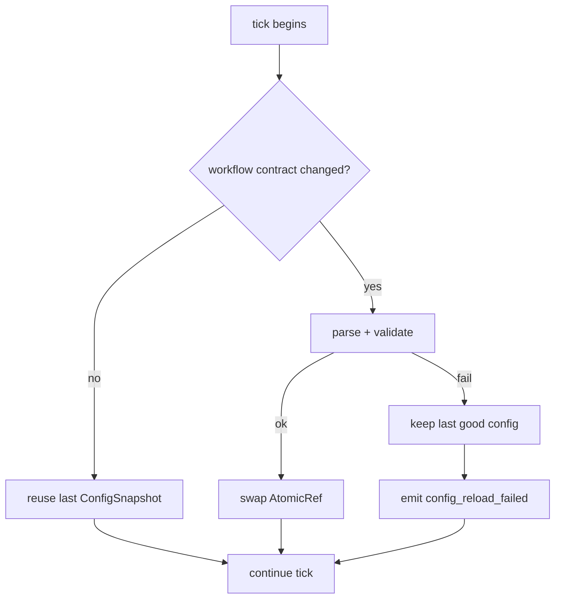
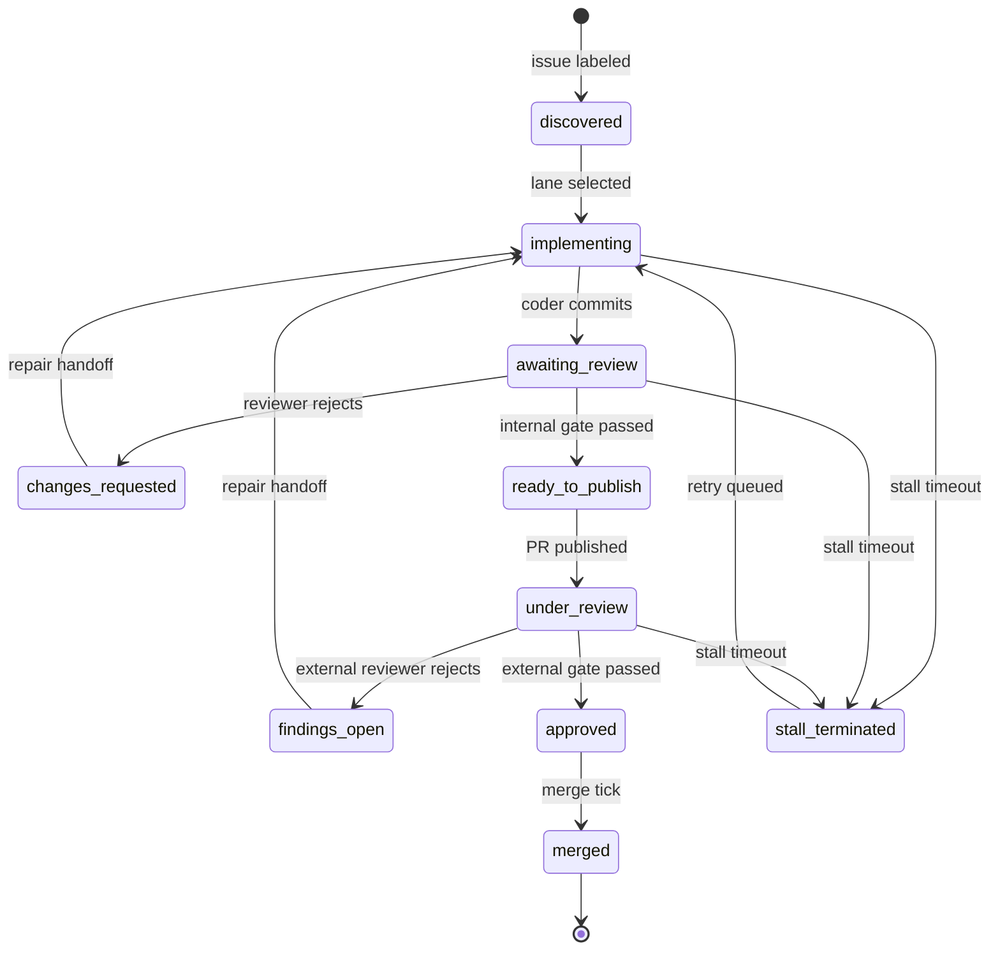

# Daedalus Architecture

<div align="center">



> **Daedalus is a durable orchestration runtime that wraps an SDLC workflow brain with leases, canonical state, action queues, role handoffs, retries, and operator tooling so agentic lanes can run continuously without turning into invisible cron-driven chaos.**

</div>

---

## The 30-Second Read

| Question | Answer |
|---|---|
| **What is it?** | A plugin that turns fragile cron-loop automation into explicit, durable, role-based 24/7 workflow orchestration. |
| **What problem does it solve?** | Agentic SDLC breaks because policy is buried in prompts, state is scattered, failures are logged but not modeled, and handoffs are implicit. |
| **How?** | Leases. SQLite canonical state. JSONL event history. Shadow/active execution. Explicit actor roles. |
| **Who owns what?** | The **wrapper** decides *what* should happen. **Daedalus** decides *how* to orchestrate it durably. |

---

## The Architecture at a Glance

```
┌─────────────────────────────────────────────────────────────────────────────┐
│                         EXTERNAL TRIGGERS                                   │
│   GitHub Issue (#42)    Operator (/daedalus)    WORKFLOW.md (hot-reload)    │
└─────────────────────────────────────────────────────────────────────────────┘
         │                       │                       │
         ▼                       ▼                       ▼
┌──────────────────────────────────────┐  ┌──────────────────────────────────────┐
│     DAEDALUS ENGINE                  │  │    WORKFLOW WRAPPER                  │
│  ─────────────────────────────────   │  │  ─────────────────────────────────   │
│  Runtime Loop                        │  │  Status / Read Model                 │
│    Tick → Ingest → Derive → Dispatch │◄─┤  Policy Engine                       │
│    → Record                          │  │  Actors (Coder / Reviewer / Merge)   │
│                                      │  │  Lane State Machine                  │
│  Leases (heartbeat · TTL · recovery) │  │  Handoffs (explicit, durable)        │
│                                      │  │                                      │
│  SQLite ──► lanes · actions ·        │  │  Semantic Actions                    │
│             reviews · failures       │  │    run_claude_review                 │
│                                      │  │    publish_ready_pr                  │
│  JSONL ───► turn_started ·           │  │    merge_and_promote                 │
│             turn_completed · stall   │  │                                      │
│                                      │  │  ▼                                   │
│  Shadow Mode ──► observe · plan      │  │  Execution Actions                   │
│  Active Mode ──► execute · dispatch  │◄─┤    request_internal_review           │
│                                      │  │    publish_pr                        │
│  Operator Surfaces                   │  │    merge_pr                          │
│    /daedalus status · doctor · watch │  │    dispatch_implementation_turn      │
│    shadow-report · active-gate       │  │                                      │
└──────────────────────────────────────┘  └──────────────────────────────────────┘
         │                                           │
         ▼                                           ▼
┌────────────────────────────┐              ┌────────────────────────────┐
│  SUPERVISION               │              │  EXTERNAL                  │
│  systemd service           │              │  GitHub API                │
│  /daedalus watch (TUI)     │              │  Webhooks (Slack / HTTP)   │
│  HTTP status :8765         │              │  Comments (PR audit trail) │
└────────────────────────────┘              └────────────────────────────┘
```

---

## The Two Brains

Daedalus has **two brains** that speak different languages. The boundary between them is the most important design decision in the system.

### Brain 1: The Workflow Wrapper (Semantic)

> *"What should happen next?"*

The wrapper is the **policy engine**. It knows about:
- GitHub issues, labels, PRs, review threads
- Semantic workflow states (`implementing`, `under_review`, `approved`)
- Review policy (Claude must pass before publish, Codex Cloud must pass before merge)
- Actor configuration (which model runs which role)

It speaks **workflow semantics**:
```
run_claude_review
publish_ready_pr
merge_and_promote
dispatch_codex_turn
```

### Brain 2: Daedalus Runtime (Execution)

> *"How do I orchestrate this durably?"*

Daedalus is the **execution engine**. It knows about:
- Leases and heartbeats
- SQLite canonical state
- Action queues and idempotency keys
- Retry bookkeeping and failure tracking
- Shadow vs active execution modes

It speaks **execution semantics**:
```
request_internal_review
publish_pr
merge_pr
dispatch_implementation_turn
dispatch_repair_handoff
```

### Why two vocabularies?

Because **policy changes faster than orchestration**. The wrapper can change its mind about when to publish. Daedalus must still guarantee that the publish action happens exactly once, survives crashes, and retries correctly.

---

## The Five Guarantees

Daedalus exists to provide five guarantees that fragile cron-loop automation cannot:

### 1. Exactly-One Ownership (Leases)

```
┌─────────┐    acquire lease     ┌─────────┐
│ Runtime │ ───────────────────► │  Lane   │
│    A    │ ◄─────────────────── │  #42    │
└─────────┘    heartbeat (TTL)   └─────────┘
      │
      │  process dies
      ▼
┌─────────┐    lease expires     ┌─────────┐
│ Runtime │ ◄─────────────────── │  Lane   │
│    B    │ ───────────────────► │  #42    │
└─────────┘   claim on next tick └─────────┘
```

- **Exclusivity:** One runtime owns a lane at a time.
- **Liveness:** Heartbeats prove the owner is alive.
- **Recovery:** Any instance can claim an expired lease. No coordinator needed.

### 2. Exactly-Once Actions (Idempotency)

Every active action has a composite key:
```
lane:<id>:<action_type>:<head_sha>
```

This prevents:
- Double-dispatching the same review on the same head
- Re-running `merge_pr` after the PR is already merged
- Spawning infinite coder sessions for a single issue

### 3. State Is Tracked, Not Guessed

| Layer | Storage | Purpose |
|---|---|---|
| **SQLite** | `daedalus.db` | Canonical runtime state now |
| **JSONL** | `daedalus-events.jsonl` | Append-only history |
| **Lane files** | `.lane-state.json` | Lane-local handoff artifacts |
| **Lane memos** | `.lane-memo.md` | Human-readable handoff notes |

Never reconstruct current state by replaying events. That's what the `lanes` table is for.

### 4. Bad Edits Don't Crash the Loop



A bad `WORKFLOW.md` edit is **ignored**, not fatal. The next valid save picks up automatically.

### 5. Recovery Is Automatic

When an action fails:
1. Failed row is persisted with `retry_count`
2. Next tick checks if retry budget remains
3. If yes: requeue with incremented `retry_count`
4. If no: transition to `operator_attention_required`
5. Human intervenes, or the lane is archived

Lost workers never block forward motion.

---

## The Lane Lifecycle

A lane is the unit of work. One GitHub issue becomes one lane. The lane carries the issue from discovery to merge.



States with no outgoing arrows (other than terminal `merged` / `closed` / `archived`) keep retrying — **the lane never crashes the loop, only the current attempt.**

---

## The Actor Model

Coding and reviewing are **explicit roles**, not ad-hoc prompt invocations.

| Role | Runtime | Model | When Active | Gate |
|---|---|---|---|---|
| **Internal Coder** | `acpx-codex` | `gpt-5.3-codex-spark/high` | Before PR exists | — |
| **Internal Reviewer** | `claude-cli` | `claude-sonnet-4-6` | Local branch exists | Must pass before publish |
| **External Reviewer** | `acpx-codex` | `gpt-5` | PR published | Must pass before merge |
| **Advisory Reviewer** | varies | varies | Any time | Informative only |

### Handoff Map

```
Orchestrator ──► Coder ──► Internal Reviewer ──► Publish ──► External Reviewer ──► Merge
     │              │              │                    │              │
     │              │              └─► repair ──────────┘              │
     │              │                                                  │
     │              └─► repair ◄───────────────────────────────────────┘
     │
     └─► restart session (if stale)
```

Every handoff survives service restarts, session staleness, and GitHub drift.

---

## Execution Modes

### Shadow Mode: "What would I do?"

- Reads workflow state
- Derives next action
- Writes **shadow** action rows (no idempotency check)
- Emits comparison reports
- **No side effects**

Use shadow mode to validate parity safely before promoting to active.

### Active Mode: "What actually happens."

- Reads workflow state
- Derives next action
- Writes **active** action rows (idempotency enforced)
- Dispatches to real runtimes
- Records success / failure / retry state

Promotion from shadow to active is gated by `active-gate-status` — an explicit operator step, not a config edit.

---

## The Data Flow (One Tick)

```
┌─────────────┐     ┌─────────────┐     ┌─────────────┐     ┌─────────────┐
│   TICK      │────►│   INGEST    │────►│   DERIVE    │────►│   DISPATCH  │
│  (cron/     │     │  wrapper    │     │  nextAction │     │  to runtime │
│   manual)   │     │  status     │     │  from state │     │  (active)   │
└─────────────┘     └─────────────┘     └─────────────┘     └─────────────┘
                                                                  │
                                                                  ▼
┌─────────────┐     ┌─────────────┐     ┌─────────────┐     ┌─────────────┐
│   NEXT      │◄────│   RECORD    │◄────│   RESULT    │◄────│   RUNTIME   │
│   TICK      │     │  success/   │     │  success/   │     │  executes   │
│             │     │  failure    │     │  failure    │     │  turn       │
└─────────────┘     └─────────────┘     └─────────────┘     └─────────────┘
```

Each tick:
1. **Ingest** — Pull wrapper status into SQLite
2. **Derive** — Compare wrapper `nextAction` with runtime state
3. **Dispatch** — If action is new and idempotency key is free, dispatch to runtime
4. **Record** — Write result (success/failure/retry) to SQLite + JSONL
5. **Heartbeat** — Refresh lease to prove liveness

---

## Operator Surfaces

Daedalus exposes tooling instead of forcing DB archaeology.

| Surface | Command | What It Answers |
|---|---|---|
| **Status** | `/daedalus status` | Runtime row, lane count, paths, freshness |
| **Doctor** | `/daedalus doctor` | Full health check across all subsystems |
| **Watch** | `/daedalus watch` | Live TUI: lanes + alerts + events |
| **Shadow Report** | `/daedalus shadow-report` | Diff shadow plan vs active reality |
| **Active Gate** | `/daedalus active-gate-status` | What's blocking promotion to active |
| **Service** | `/daedalus service-status` | systemd health snapshot |
| **HTTP** | `GET localhost:8765/api/v1/state` | JSON snapshot for dashboards |

---

## Repository Anatomy

```
daedalus/
├── __init__.py              # Plugin registration
├── plugin.yaml              # Plugin manifest
├── schemas.py               # CLI/slash parser schema
├── tools.py                 # Operator surface + systemd helpers
├── runtime.py               # Durable engine (the heart)
│   ├── database schema
│   ├── leases + heartbeats
│   ├── ingestion
│   ├── action derivation
│   ├── active execution
│   ├── retries + failure tracking
│   └── runtime loops
├── alerts.py                # Outage alert logic
├── watch.py                 # TUI frame renderer
├── watch_sources.py         # Lane + alert + event aggregation
├── formatters.py            # Human-readable inspection output
├── migration.py             # relay→daedalus filesystem migration
├── observability_overrides.py  # Operator config overrides
└── workflows/
    ├── __init__.py          # Workflow CLI entrypoint
    └── code_review/
        ├── workflow.py      # Semantic policy engine
        ├── dispatch.py      # Action dispatch
        ├── actions.py       # Action primitives
        ├── reviews.py       # Review policy + findings
        ├── sessions.py      # Session protocol
        ├── runtimes/        # Runtime adapters
        │   ├── claude_cli.py
        │   ├── acpx_codex.py
        │   └── hermes_agent.py
        ├── reviewers/       # Reviewer implementations
        ├── webhooks/        # Outbound webhook subscribers
        ├── server/          # HTTP status surface
        ├── comments.py      # GitHub comment formatting
        └── observability.py # Config resolution
```

---

## Example Transitional Deployment

One practical deployment shape is a **sensible transitional architecture**:

| Layer | Owner | Role |
|---|---|---|
| **Workflow module** | Project workflow | Semantic policy engine |
| **Daedalus active service** | systemd | Recurring dispatcher |
| **Workflow `tick`** | Manual fallback | Operator override |
| **Milestone notifier** | Hermes cron | Support job (not orchestrator) |
| **Outage alerts** | Daedalus alerts | Support surface (not scheduler) |

It is not fully pure yet, but it is sane.

---

## Long-Term Vision

> Full agentic SDLC lanes that run continuously, respect policy and review gates, survive failures, and let humans stay passive by default while stepping in only when judgment or escalation is truly needed.

That means:
- Each lane is durable
- Coding and reviewing are explicit roles
- State transitions are auditable
- Failures are recoverable
- Humans observe or intervene without becoming the scheduler
- The system runs 24/7 without degrading into prompt spaghetti

**Daedalus is the control-plane skeleton for that future.**

---

## See Also

| Doc | What It Covers |
|---|---|
| [`concepts/lanes.md`](concepts/lanes.md) | Lane state machine, selection, workspace binding |
| [`concepts/actions.md`](concepts/actions.md) | Action types, idempotency, shadow vs active |
| [`concepts/failures.md`](concepts/failures.md) | Failure lifecycle, retry policy, lane-220 fixes |
| [`concepts/leases.md`](concepts/leases.md) | Lease acquisition, heartbeat, recovery, split-brain |
| [`concepts/reviewers.md`](concepts/reviewers.md) | Internal/external/advisory review pipeline |
| [`concepts/observability.md`](concepts/observability.md) | Watch TUI, HTTP server, GitHub comments |
| [`concepts/operator-attention.md`](concepts/operator-attention.md) | When attention triggers, thresholds, recovery |
| [`operator/cheat-sheet.md`](operator/cheat-sheet.md) | Day-to-day commands, debugging, SQL cheats |

---

## Architecture in One Sentence

**Daedalus is a durable orchestration runtime that wraps an SDLC workflow brain with leases, canonical state, action queues, role handoffs, retries, and operator tooling so agentic lanes can run continuously without turning into invisible cron-driven chaos.**
