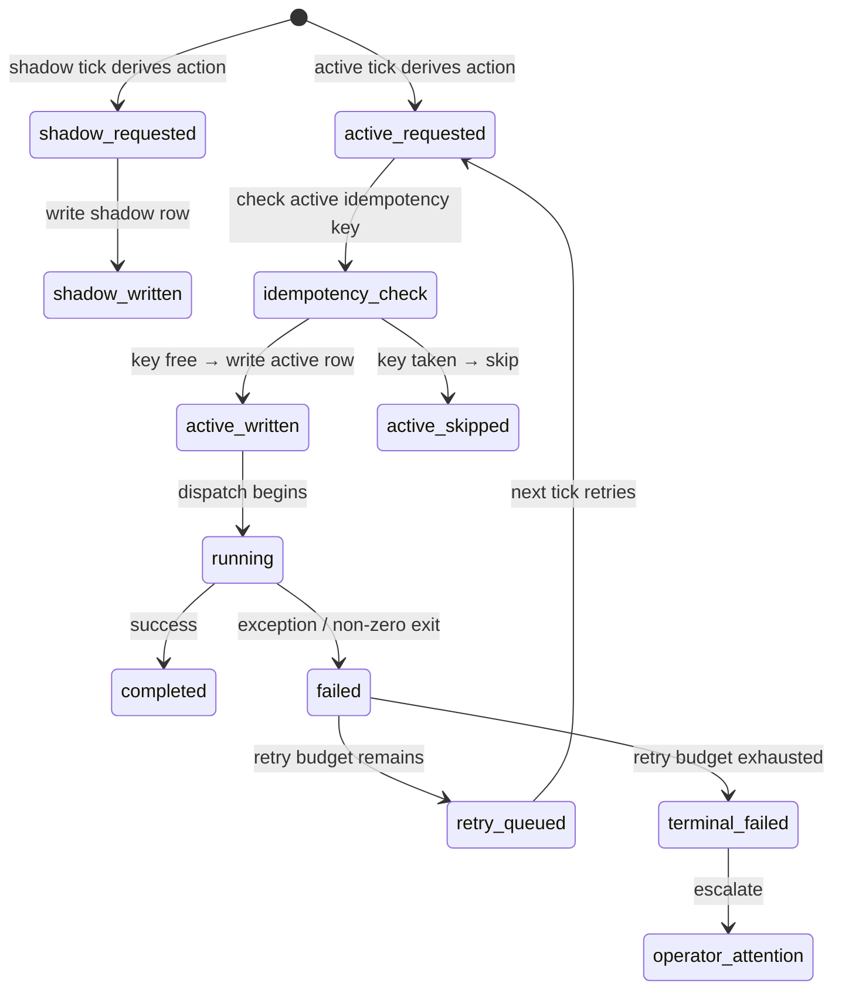

# Actions

An **action** is the atomic unit of work Daedalus queues, executes, and tracks. The wrapper decides *what should happen*; Daedalus decides *how to orchestrate it durably* by translating wrapper semantic actions into execution actions.

---

## Two vocabularies

| Wrapper semantic action | Daedalus execution action |
|---|---|
| `run_claude_review` | `request_internal_review` |
| `publish_ready_pr` | `publish_pr` |
| `merge_and_promote` | `merge_pr` |
| `dispatch_codex_turn` | `dispatch_implementation_turn` |
| `restart_actor_session` | `restart_actor_session` |
| `dispatch_repair_handoff` | `dispatch_repair_handoff` |

That translation boundary is deliberate. The wrapper speaks **workflow semantics**; Daedalus speaks **execution semantics**.

---

## Action types

### Coder actions

| Action | When dispatched |
|---|---|
| `dispatch_implementation_turn` | Lane has an active issue, no PR yet, and the coder session is ready. |
| `dispatch_repair_handoff` | Reviewer (internal or external) returned findings; the coder must repair. |
| `restart_actor_session` | Session is stale, wedged, or the operator requested a fresh start. |

### Review actions

| Action | When dispatched |
|---|---|
| `request_internal_review` | Local unpublished branch exists and needs Claude gate before publish. |

### PR lifecycle actions

| Action | When dispatched |
|---|---|
| `publish_pr` | Local gate passed; create or mark PR ready-for-review. |
| `push_pr_update` | Coder made new commits after PR exists; push update. |
| `merge_pr` | External review passed; merge and close issue. |

---

## Action row lifecycle



---

## Idempotency

Every active action has an **idempotency key**:

```
lane:<id>:<action_type>:<head_sha>
```

Example:
```
lane:220:request_internal_review:abc123def...
```

### Rules

- **Shadow actions** have no idempotency check — they are purely speculative.
- **Active actions** are blocked if an un-failed row with the same key exists.
- **Failed actions** can requeue if `retry_count < max_retries` (see [failures.md](failures.md)).
- **Completed actions** are ignored; the lane has moved on.

This prevents:
- Double-dispatching the same review on the same head
- Re-running `merge_pr` after the PR is already merged
- Spawning infinite coder sessions for a single issue

---

## Shadow vs active action rows

| Property | Shadow | Active |
|---|---|---|
| Table | `lane_actions` (same table) | `lane_actions` (same table) |
| `mode` column | `shadow` | `active` |
| Idempotency check | ❌ none | ✅ enforced |
| Side effects | ❌ none | ✅ dispatched to runtimes |
| GitHub mutations | ❌ none | ✅ comments, merges, PRs |
| Purpose | "what would happen" | "what actually happens" |

Shadow rows are written so the operator can diff:

```bash
/daedalus shadow-report
```

This compares shadow plan vs active reality to catch policy regressions.

---

## Retry semantics

See [failures.md](failures.md) for the full failure/retry model. At the action level:

- `retry_count` starts at `0`.
- Each retry attempt increments it.
- `max_retries` is configured in `WORKFLOW.md` (default: `3`).
- The retry reason is recorded: `stall_timeout`, `runtime_error`, `operator_reset`, etc.

---

## Action queue SQL

### Show pending actions for a lane

```sql
select action_id, action_type, mode, status, retry_count, requested_at
from lane_actions
where lane_id='lane:220' and status in ('requested', 'running')
order by requested_at desc;
```

### Show action history for a lane

```sql
select action_id, action_type, mode, status, retry_count, requested_at, completed_at, failed_at
from lane_actions
where lane_id='lane:220'
order by requested_at desc;
```

### Check idempotency key collision

```sql
select action_id, status, retry_count
from lane_actions
where lane_id='lane:220'
  and action_type='request_internal_review'
  and head_sha='abc123def...';
```

---

## Where this lives in code

- Action dispatch: `daedalus/runtime.py` (look for `request_active_action`, `iterate_active`)
- Idempotency: `daedalus/runtime.py` (look for `action_idempotency_key`, `can_requeue`)
- Shadow vs active: `daedalus/runtime.py` (look for `Mode.SHADOW`, `Mode.ACTIVE`)
- Action execution: `daedalus/workflows/code_review/dispatch.py`
- Action primitives: `daedalus/workflows/code_review/actions.py`
- Tests: `tests/test_workflows_code_review_actions.py`, `tests/test_stall_detection.py`
