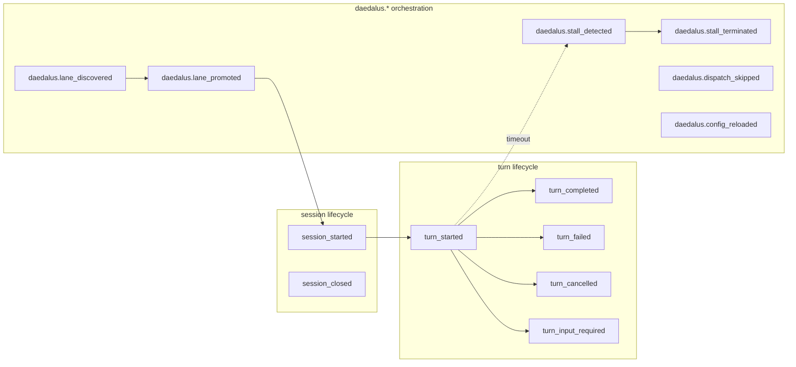

# Events

Append-only history of everything that happened. Events are written to `daedalus-events.jsonl` (one JSON object per line) and consumed by:

- the operator dashboard (recent-event tail)
- the alerting layer
- post-hoc auditing
- regression tests that snapshot lifecycles

State is in SQLite. **History is in events.** Never reconstruct current state by replaying events — that's what the lanes table is for.

## Anatomy of an event

```json
{
  "type": "daedalus.turn_completed",
  "lane_id": "01HF3Q…",
  "issue_number": 42,
  "actor_id": "coder-claude-1",
  "at": "2026-04-28T14:03:11Z",
  "payload": { "model": "opus", "input_tokens": 1342, "output_tokens": 506 }
}
```

## Taxonomy (Symphony §10.4)

Daedalus follows the Symphony event taxonomy with a `daedalus.*` prefix on orchestration events. The bare names are defined as Symphony-compatible aliases (`workflows.code_review.event_taxonomy.EVENT_ALIASES`) and run for one release before the prefixed form becomes the only canonical type.



## Where bare-name vs prefixed applies

| Layer | Bare name | Prefixed |
|---|---|---|
| Turn-level (model, runtime) | ✅ canonical | also accepted |
| Lane-level (Daedalus orchestration) | accepted (alias window) | ✅ canonical |
| Session-level | ✅ canonical | also accepted |

`workflows.code_review.event_taxonomy.canonicalize(event_type)` resolves either form to the current canonical name.

## Reading events efficiently

The dashboard tails the last 20 events on every HTTP hit. Naïve `readlines()` is O(file size); the implementation in `workflows/code_review/server/views.py::_read_events_tail` uses an 8 KiB reverse-chunked seek so request cost is bounded regardless of how big the log gets. Same algorithm if you write your own consumer.

## Where this lives in code

- Taxonomy constants: `workflows/code_review/event_taxonomy.py`
- Writer: `runtime.py::append_daedalus_event`
- Reader (tail): `workflows/code_review/server/views.py::_read_events_tail`
- AST regression test: `tests/test_event_taxonomy.py` ensures `runtime.py` only emits known event types
