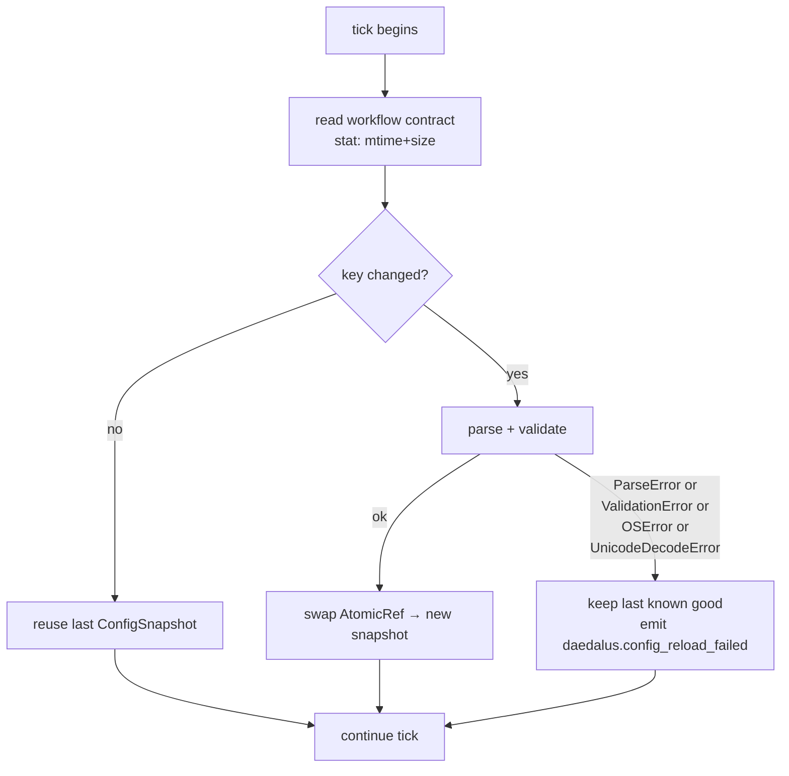
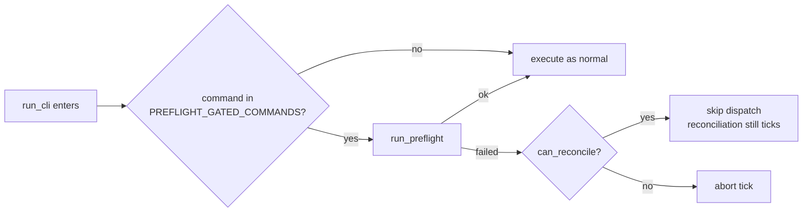

# Hot-reload & per-tick preflight

Symphony §6.2 + §6.3. The two halves of "edits to the workflow contract should never crash the loop."

## §6.2 Hot-reload

The workflow contract (`WORKFLOW.md` for new instances, `config/workflow.yaml` for legacy ones) is re-parsed and re-validated on every tick. The new config replaces the old one **only if** parse + validate both succeed. A bad edit keeps the previous good config alive — the next valid save picks up automatically.

### Why `(mtime, size)` instead of just mtime

Some filesystems (NFS, coarse-mtime FS) can produce a same-mtime write. The size guards against that. If you build something on top of `ConfigWatcher`, use the same tuple key.

### Snapshot safety

`ConfigSnapshot` is a frozen dataclass and inner dicts are wrapped in `MappingProxyType` — the snapshot can be passed across threads without copy. Readers go through `AtomicRef.get()` which is lock-free; writers (the watcher) hold a lock to swap.

## §6.3 Per-tick preflight

Even with hot-reload, *some* configurations are bad enough that dispatch can't proceed — e.g., a referenced runtime that doesn't exist. Preflight is the single check that runs at the top of every gated command:

`PREFLIGHT_GATED_COMMANDS` is declared on the workflow module (`daedalus/workflows/code_review/__init__.py`). Today it gates `tick`, `dispatch-implementation-turn`, `dispatch-internal-review-turn`, `dispatch-external-review-turn`, and `dispatch-merge-turn`. Read-only commands (`status`, `inspect`) bypass the gate.

### What preflight actually checks

- The workflow contract parses
- The projected workflow config matches `schema.yaml`
- Every referenced runtime kind (`runtimes.<name>.kind`, `agents.external-reviewer.kind`) is registered
- Lane-selection config, if present, is internally consistent

`PreflightResult.can_reconcile=True` (the default) means: dispatch is unsafe but reconciliation (lease recovery, stall detection, status reads) is still safe. That's the rule that keeps a bad edit from killing the loop.

## Where this lives in code

- `ConfigSnapshot` + `AtomicRef`: `daedalus/workflows/code_review/config_snapshot.py`
- Watcher: `daedalus/workflows/code_review/config_watcher.py`
- Preflight: `daedalus/workflows/code_review/preflight.py`
- Gating: `daedalus/workflows/__init__.py::run_cli` reads `PREFLIGHT_GATED_COMMANDS`
- Tests: `tests/test_config_snapshot.py`, `tests/test_config_watcher.py`, `tests/test_workflows_preflight_cli_integration.py`
