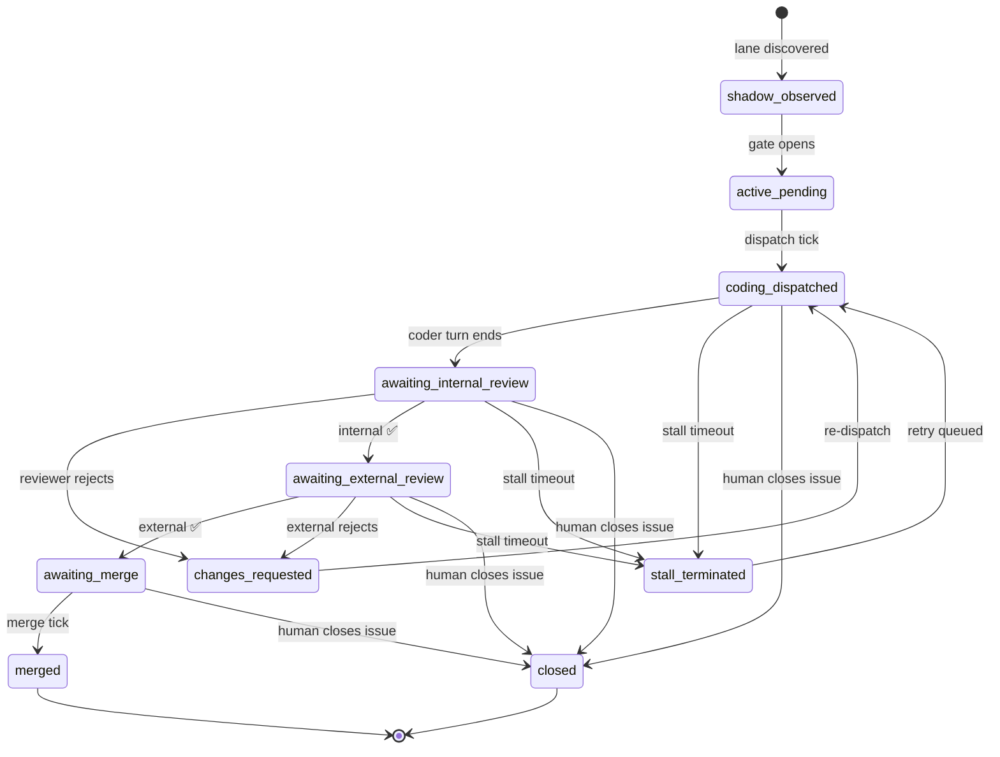
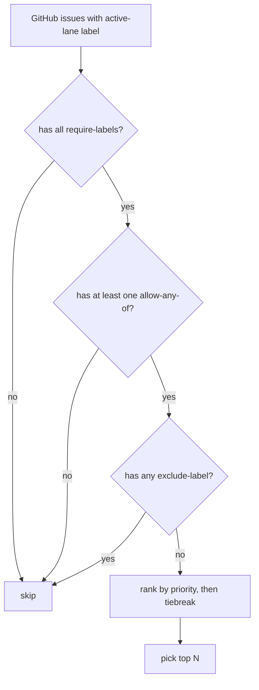

# Lanes

A **lane** is the unit of work Daedalus orchestrates. One GitHub issue (with a configured label) becomes one lane. The lane carries the issue through `shadow → active → coding → review → merge` and out the other side.

## State machine



States with no outgoing arrows in this diagram (other than terminal `merged` / `closed` / `archived`) keep retrying — the lane never crashes the loop, only the current attempt.

## Lifecycle anchors

| Field | Type | Meaning |
|---|---|---|
| `lane_id` | string | Stable identifier (UUID v4). |
| `issue_number` | int | GitHub issue number. The friendly form `#42` is what humans use. |
| `issue_url` | string | Full URL — for clicking from the dashboard. |
| `workflow_state` | enum | One of the states above. Owned by the workflow wrapper. |
| `lane_status` | enum | `running` / `retrying` / `merged` / `closed` / `archived`. Owned by Daedalus. |
| `active_actor_id` | string \| null | Lease holder for the next action, or `null` when idle. |
| `current_action_id` | string \| null | Running action row, or `null`. |
| `created_at` / `updated_at` | timestamp | Standard auditing. |
| `last_meaningful_progress_at` | timestamp | Most recent forward step (used for stall heuristics). |
| `last_meaningful_progress_kind` | string | The event kind that updated it. |

## Terminal states

`merged`, `closed`, and `archived` are terminal. The `workflows.code_review.server.views._TERMINAL_LANE_STATUSES` set keeps these out of the operator dashboard. Anything else is "active" for observability purposes.

## Lane selection

Not every labeled issue becomes a lane. `lane_selection.py` filters and ranks issues using the `lane-selection:` block in the workflow contract (`WORKFLOW.md` for new instances).

### Config schema

```yaml
lane-selection:
  require-labels: ["bug", "ready"]      # must have ALL of these
  allow-any-of: ["feature", "refactor"]  # must have AT LEAST ONE of these
  exclude-labels: ["blocked"]            # must have NONE of these
  priority: ["urgent", "security"]       # boost these to the front
  tiebreak: "oldest"                     # "oldest" | "newest" | "random"
```

### Defaults

| Field | Default | Notes |
|---|---|---|
| `require-labels` | `[]` | Empty = no required labels. |
| `allow-any-of` | `[]` | Empty = no restriction. |
| `exclude-labels` | `[<active-lane-label>]` | Auto-injected so currently-active lanes are never re-picked. |
| `priority` | `[]` | Empty = no priority boost. |
| `tiebreak` | `"oldest"` | How to rank candidates after filtering. |

### Selection flow



### Workspace binding

Each lane is bound to a **workspace** (a temporary directory under `/tmp/`). The workspace holds:
- A clone of the target repo
- `.lane-state.json` — lane-local state
- `.lane-memo.md` — handoff notes between actors

---

## Where this lives in code

- Schema: `daedalus/workflows/code_review/migrations.py` (lanes table)
- Selection config: `daedalus/workflows/code_review/lane_selection.py`
- Selection logic: `daedalus/workflows/code_review/lane_selection.py` + `workspace.py`
- State transitions: `daedalus/workflows/code_review/workflow.py` + `dispatch.py`
- Read views: `daedalus/workflows/code_review/server/views.py`
