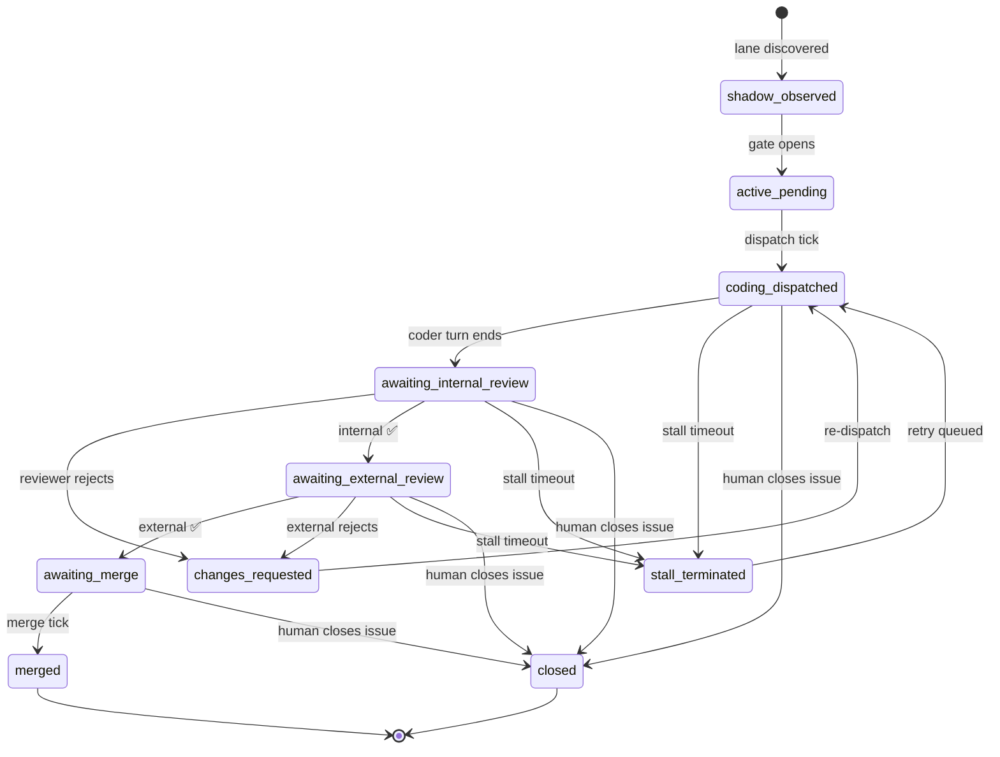

# Lanes

A **lane** is the unit of work Daedalus orchestrates. One GitHub issue (with a configured label) becomes one lane. The lane carries the issue through `shadow → active → coding → review → merge` and out the other side.

## State machine

States with no outgoing arrows in this diagram (other than terminal `merged` / `closed` / `archived`) keep retrying — the lane never crashes the loop, only the current attempt.

## Lifecycle anchors

| Field | Type | Meaning |
|---|---|---|
| `lane_id` | string | Stable identifier (UUID v4). |
| `issue_number` | int | GitHub issue number. The friendly form `#42` is what humans use. |
| `issue_url` | string | Full URL — for clicking from the dashboard. |
| `workflow_state` | enum | One of the states above. Owned by the workflow wrapper. |
| `lane_status` | enum | `running` / `retrying` / `merged` / `closed` / `archived`. Owned by Daedalus. |
| `active_actor_id` | string \| null | Lease holder for the next action, or `null` when idle. |
| `current_action_id` | string \| null | Running action row, or `null`. |
| `created_at` / `updated_at` | timestamp | Standard auditing. |
| `last_meaningful_progress_at` | timestamp | Most recent forward step (used for stall heuristics). |
| `last_meaningful_progress_kind` | string | The event kind that updated it. |

## Terminal states

`merged`, `closed`, and `archived` are terminal. The `workflows.code_review.server.views._TERMINAL_LANE_STATUSES` set keeps these out of the operator dashboard. Anything else is "active" for observability purposes.

## Where this lives in code

- Schema: `workflows/code_review/migrations.py` (lanes table)
- Selection: `workflows/code_review/lane_selection.py` (which issues become lanes)
- State transitions: `workflows/code_review/workflow.py` + `dispatch.py`
- Read views: `workflows/code_review/server/views.py`
