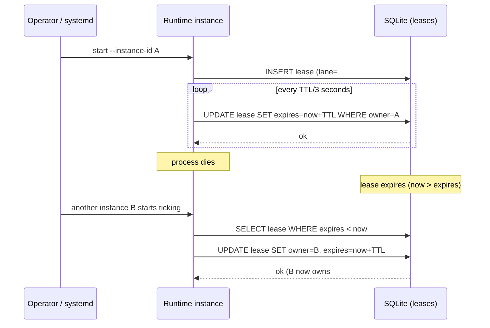

# Leases & heartbeats

The thread Theseus carried into the labyrinth. Daedalus uses leases to make sure exactly one runtime owns a lane at a time — and recovers automatically when an owner dies.

## What a lease guarantees

1. **Exclusivity.** While a lease is held, no other instance will pick the same lane.
2. **Liveness.** Every `ttl-seconds` interval, the holder must heartbeat. Missed heartbeats expire the lease.
3. **Hand-off.** When a lease expires, *any* instance can claim it on the next tick. No coordinator required.

## Heartbeat loop

## Recovery semantics

- Default TTL is configured per-instance via `--ttl-seconds` (typical: 60s).
- A lease that's missed `> ttl` seconds of heartbeats is considered expired.
- `daedalus doctor` reports expired leases as recoverable, not as errors.
- When B claims a lease previously held by A, the action row's `current_action_id` is **not** automatically reset — the workflow wrapper decides whether to resume or restart based on state.

## Split-brain check

`runtime.py::detect_split_brain()` scans for two non-expired leases on the same lane. This *should* be impossible (the UPDATE is atomic), but the check exists to catch clock skew across hosts. The cheat sheet shows how to trigger it manually.

## Where this lives in code

- Lease + heartbeat tables: `runtime.py` (look for `acquire_lease`, `heartbeat`, `release_lease`)
- Recovery: `runtime.py::reconcile_leases()`
- CLI surface: `runtime.py heartbeat`, `runtime.py iterate-active`
