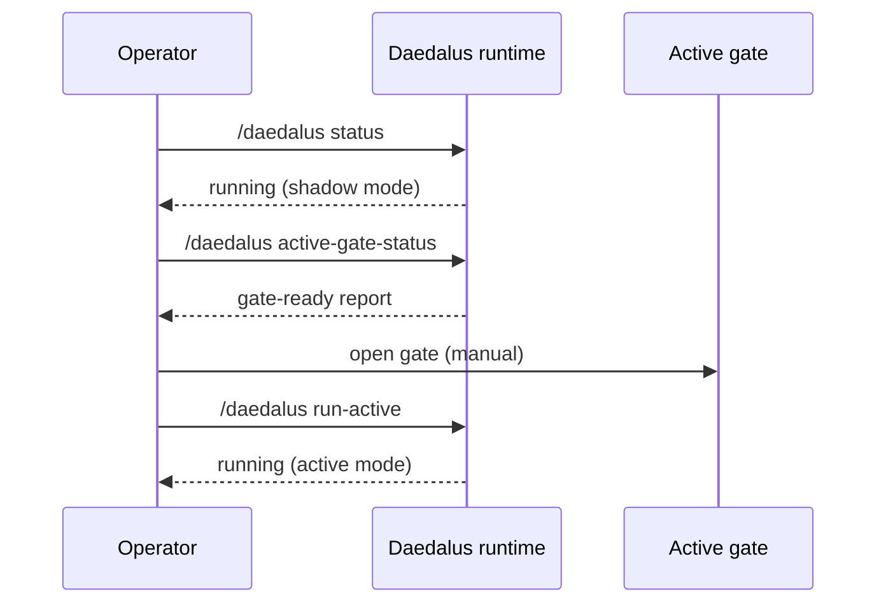

# Migration & Cutover

Daedalus was previously known as **hermes-relay**. The rename introduced new state paths, new systemd unit names, and a new plugin registration model. This document covers how to migrate from relay-era deployments and how cutover between shadow and active modes works.

---

## What changed in the rename

| Relay-era | Daedalus |
|---|---|
| `hermes-relay` | `daedalus` |
| `relay.db` | `daedalus.db` |
| `relay-events.jsonl` | `daedalus-events.jsonl` |
| `relay-active@.service` | `daedalus-active@.service` |
| `scripts/yoyopod_workflow.py` | `workflows/__main__.py` (plugin-owned) |
| `relay/` directory | `daedalus/` directory |
| `watchdog` terminology | `engine` / `runtime` terminology |

---

## Filesystem migration

### One-shot command

```bash
/daedalus migrate-filesystem
```

This renames relay-era state files to daedalus paths:
- `relay.db` → `daedalus.db`
- `relay-events.jsonl` → `daedalus-events.jsonl`
- Legacy control schema JSON → new ownership schema

It is **idempotent** — running it twice is safe.

### Manual fallback

If the command is unavailable, the migration is a simple rename:

```bash
mv ~/.hermes/workflows/yoyopod/state/relay/relay.db \
   ~/.hermes/workflows/yoyopod/state/daedalus/daedalus.db

mv ~/.hermes/workflows/yoyopod/memory/relay-events.jsonl \
   ~/.hermes/workflows/yoyopod/memory/daedalus-events.jsonl
```

---

## Systemd migration

### One-shot command

```bash
/daedalus migrate-systemd
```

This:
1. Stops `relay-active@yoyopod.service`
2. Disables it
3. Installs `daedalus-active@yoyopod.service`
4. Enables and starts it

### Manual fallback

```bash
# Stop old
systemctl --user stop relay-active@yoyopod.service
systemctl --user disable relay-active@yoyopod.service

# Install new
python3 ~/.hermes/workflows/yoyopod/.hermes/plugins/daedalus/scripts/install.py

# Start new
systemctl --user enable daedalus-active@yoyopod.service
systemctl --user start daedalus-active@yoyopod.service
```

---

## Config migration

The workflow wrapper CLI moved from `scripts/yoyopod_workflow.py` to `workflows/__main__.py`. If you have cron jobs or aliases pointing at the old path, update them:

```bash
# Old (retired)
python3 scripts/yoyopod_workflow.py status --json

# New
python3 -m workflows --workflow-root ~/.hermes/workflows/yoyopod status --json
```

The `scripts/migrate_config.py` helper can rewrite paths in shell scripts and systemd units.

---

## Shadow → active cutover

Daedalus runs in **shadow** mode by default after installation. It observes, derives actions, and writes shadow rows — but never dispatches to real runtimes.

### Promotion sequence



### Gate checks

Before active mode is allowed, `active-gate-status` verifies:

1. **Ownership posture** — `primary_owner = daedalus`
2. **Active execution** — enabled in config
3. **Runtime mode** — not already running active elsewhere
4. **Legacy watchdog** — retired (no split-brain with relay)

If any check fails, the gate is **BLOCKED** and the operator sees exactly why.

---

## Rollback

If active mode causes problems:

```bash
# Stop active service
/daedalus service-stop

# Switch back to shadow
/daedalus run-shadow

# Or disable active execution entirely
/daedalus set-active-execution --enabled false
```

The shadow rows remain, so you can diff "what shadow would do" vs "what active did" before attempting promotion again.

---

## Where this lives in code

- Filesystem migration: `daedalus/migration.py`
- Systemd templates: `daedalus/tools.py` (service-install helpers)
- Migration scripts: `scripts/migrate_config.py`, `scripts/install.py`
- Active gate: `daedalus/runtime.py::active_gate_status`
- Shadow/active modes: `daedalus/runtime.py` (look for `Mode.SHADOW`, `Mode.ACTIVE`)
- ADR: `docs/adr/ADR-0003-daedalus-rebrand.md`
- Tests: `tests/test_daedalus_migration.py`, `tests/test_migrate_config.py`
