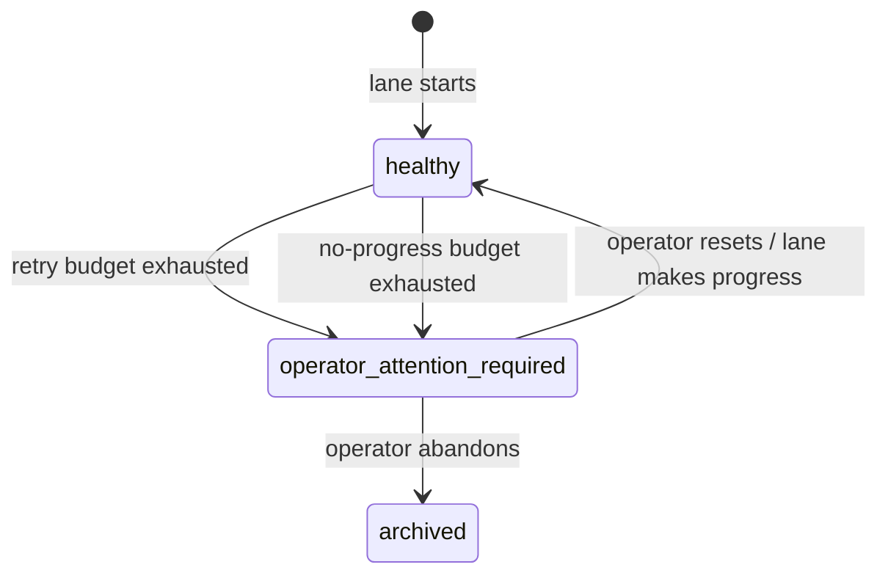

# Operator Attention

**Operator attention** is the state a lane enters when the workflow can no longer make forward progress automatically. It is a deliberate escalation — not a crash — that signals a human needs to look at the lane and decide what happens next.

---

## When operator attention is triggered

A lane enters `operator_attention_required` when **either** threshold is crossed:

| Threshold | Default | Meaning |
|---|---|---|
| **Failure retry budget exhausted** | 5 retries | The same action has failed 5 times without success. |
| **No-progress tick budget exhausted** | 5 ticks | The lane has ticked 5 times without making any forward progress (new commits, new reviews, new state). |

Both thresholds are configurable in `WORKFLOW.md`:

```yaml
policy:
  lane-operator-attention-retry-threshold: 5
  lane-operator-attention-no-progress-threshold: 5
```

---

## State machine



The transition is **one-way** until the operator intervenes or the lane makes genuine forward progress. Simply retrying the same failing action does not clear operator attention.

---

## Reason tracking

When a lane enters operator attention, the system records **why**:

```python
reasons = [
    "operator-attention-required:failure-retry-count=5",
    "operator-attention-required:no-progress-ticks=5",
]
```

These reasons are:
- Stored in `lanes.operator_attention_reason` (SQLite)
- Emitted in the `operator-attention-transition` audit event
- Rendered in the GitHub comment header (⚠️ operator-attention)
- Shown in `/daedalus doctor` and `/daedalus status`

### Reason format

```
operator-attention-required:<kind>=<value>
```

| Kind | Value | Trigger |
|---|---|---|
| `failure-retry-count` | Integer | `lane_actions.retry_count` for the current action. |
| `no-progress-ticks` | Integer | Consecutive ticks with no state change. |

---

## Ingestion protection

A critical design rule: **ingesting legacy status must not clear relay-set operator attention**.

When `ingest_legacy_status` runs (every tick), it updates the lane row from the wrapper's read model. The `ON CONFLICT DO UPDATE` has special logic:

```sql
operator_attention_required = CASE
  WHEN lanes.operator_attention_reason LIKE 'active-action-failed:%'
       AND excluded.operator_attention_required = 0
  THEN lanes.operator_attention_required   -- preserve relay-set attention
  ELSE excluded.operator_attention_required
END,
operator_attention_reason = CASE
  WHEN lanes.operator_attention_reason LIKE 'active-action-failed:%'
       AND excluded.operator_attention_required = 0
  THEN lanes.operator_attention_reason     -- preserve relay-set reason
  WHEN excluded.operator_attention_required = 1
  THEN excluded.operator_attention_reason
  ELSE NULL
END,
```

This means:
- If Daedalus (relay) set operator attention due to an active action failure, the wrapper cannot clear it.
- If the wrapper sets operator attention, that is respected.
- If neither side sets it, the field is cleared.

This prevents the wrapper's stale read model from silently overriding the runtime's failure tracking.

---

## Audit events

Two semantic events are emitted on boundary crossings:

### `operator-attention-transition`

Emitted when a lane **enters** operator attention:

```json
{
  "action": "operator-attention-transition",
  "summary": "Lane entered operator-attention state",
  "reason": "operator-attention-required:failure-retry-count=5",
  "previousState": "under_review"
}
```

### `operator-attention-recovered`

Emitted when a lane **leaves** operator attention:

```json
{
  "action": "operator-attention-recovered",
  "summary": "Lane recovered from operator-attention state",
  "newState": "under_review"
}
```

The comment publisher listens for both events to render/clear the ⚠️ sticky header on GitHub.

---

## Operator commands

When a lane is in operator attention, the operator can:

| Command | Effect |
|---|---|
| `/workflow code-review tick` | Force another attempt (bypasses retry budget). |
| `/workflow code-review pause` | Stop processing the lane entirely. |
| `/workflow code-review resume` | Resume normal processing. |
| `/daedalus doctor` | See full context on why attention was triggered. |
| `/daedalus analyze-failure --failure-id <id>` | Deep-dive a specific failure. |

---

## SQL debugging

### Show lanes in operator attention

```sql
select lane_id, issue_number, workflow_state, operator_attention_reason, updated_at
from lanes
where operator_attention_required = 1
order by updated_at desc;
```

### Show operator attention history for a lane

```sql
select action, summary, extra, at
from daedalus_events
where lane_id = 'lane:220'
  and action in ('operator-attention-transition', 'operator-attention-recovered')
order by at desc;
```

### Count operator attention transitions today

```sql
select count(*)
from daedalus_events
where action = 'operator-attention-transition'
  and date(at) = date('now');
```

---

## Where this lives in code

- Threshold logic: `daedalus/workflows/code_review/workspace.py` (`_lane_operator_attention_reasons`, `_lane_operator_attention_needed`)
- Transition emission: `daedalus/workflows/code_review/orchestrator.py` (`emit_operator_attention_transition`)
- Ingestion protection: `daedalus/runtime.py` (`ingest_legacy_status`, `ON CONFLICT DO UPDATE`)
- Threshold config: `daedalus/workflows/code_review/workspace.py` (`lane_operator_attention_retry_threshold`, `lane_operator_attention_no_progress_threshold`)
- Comment rendering: `daedalus/workflows/code_review/comments.py` (⚠️ header)
- Event taxonomy: `daedalus/workflows/code_review/event_taxonomy.py`
- Tests: `tests/test_workflow_code_review_operator_attention_audit.py`
