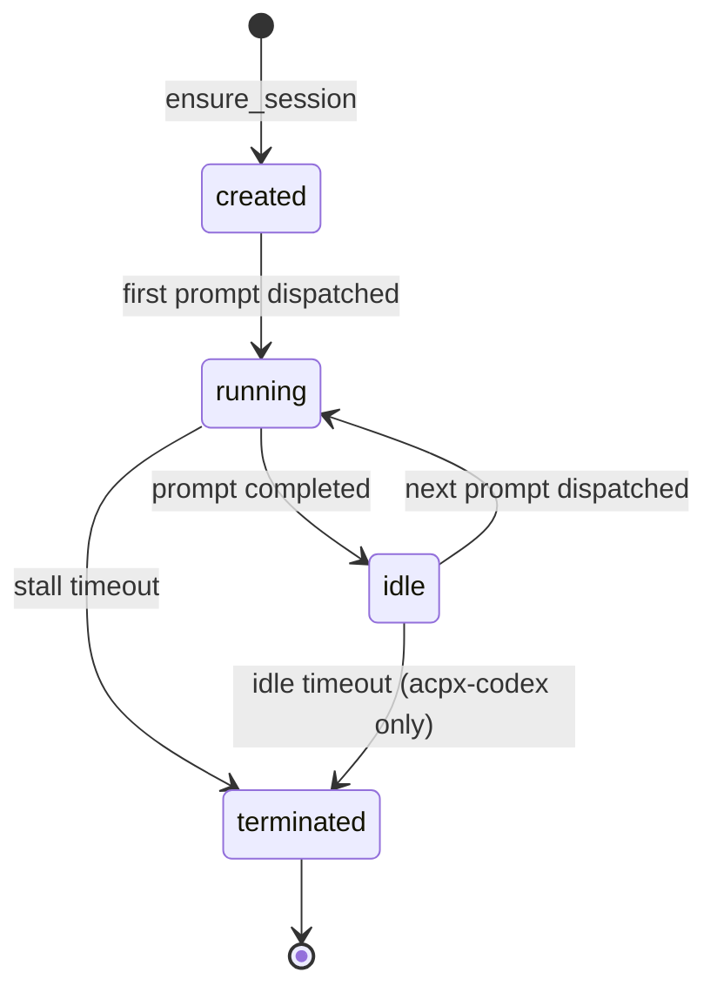

# Sessions

A **session** is the runtime's handle to a persistent or one-shot actor process. Daedalus tracks sessions per lane so it knows which actor owns which worktree, whether the session is still alive, and when it last did something useful.

---

## Session model

Sessions are owned by the **runtime adapter**, not by Daedalus directly. Daedalus asks the runtime: "do you have a session for lane X?" and the runtime answers yes/no/healthy/stale.

### Session lifecycle



### Session properties

| Property | Meaning |
|---|---|
| `session_name` | Human-readable name, e.g. `coder-claude-1`. |
| `session_id` | Runtime-specific handle. For acpx-codex: the Codex session UUID. For claude-cli: always `None` (one-shot). |
| `worktree` | Path to the lane's workspace clone. |
| `model` | Model string used for this session. |
| `resume_session_id` | If restarting, the old session ID to resume from. |

---

## Runtime-specific session behavior

### `claude-cli` (one-shot)

- No persistent session.
- `ensure_session` is a no-op.
- `run_prompt` spawns `claude --print …` as a subprocess.
- `assess_health` always returns healthy.
- `close_session` is a no-op.

### `acpx-codex` (resumable)

- Persistent session across multiple turns.
- `ensure_session` calls `acpx codex sessions ensure`.
- `run_prompt` calls `acpx codex prompt -s <name>`.
- `assess_health` checks session freshness against `session-idle-freshness-seconds` and `session-idle-grace-seconds`.
- `close_session` calls `acpx codex sessions close`.
- `last_activity_ts` returns the most recent prompt start or completion time.

### `hermes-agent` (one-shot)

- No persistent session.
- Requires a `command:` override in `WORKFLOW.md`.
- `assess_health` always returns healthy.
- `last_activity_ts` records subprocess start/end timestamps.

---

## Session health

The `assess_health` protocol returns:

```python
class SessionHealth:
    status: "healthy" | "stale" | "unknown"
    reason: str | None
    last_activity_ts: float | None
```

| Status | Meaning | Action |
|---|---|---|
| `healthy` | Session is responsive and recent. | Continue dispatching. |
| `stale` | Session hasn't been active longer than the freshness threshold. | Emit `daedalus.stall_detected`, terminate, retry. |
| `unknown` | Runtime doesn't implement health checks. | Skip stall detection for this session. |

---

## Session naming convention

Sessions are named per lane and role:

```
<role>-<backend>-<lane_short_id>
```

Examples:
- `coder-claude-220` — Coder session for lane 220
- `reviewer-codex-220` — External reviewer session for lane 220

The `lane_short_id` is the issue number (or a hash if the lane has no issue). This makes session names human-readable and unique.

---

## SQL debugging

### Show actor sessions for a lane

```sql
select actor_id, backend_identity, runtime_status, session_action_recommendation, last_used_at, can_continue, can_nudge
from lane_actors
where lane_id='lane:220';
```

### Find stale sessions

```sql
select lane_id, actor_id, last_used_at
from lane_actors
where can_continue = false
   or (can_nudge = true and datetime(last_used_at, '+15 minutes') < datetime('now'));
```

---

## Where this lives in code

- Session protocol: `daedalus/workflows/code_review/sessions.py`
- Runtime adapters: `daedalus/workflows/code_review/runtimes/{claude_cli,acpx_codex,hermes_agent}.py`
- Health checks: `daedalus/workflows/code_review/health.py`
- Stall detection: `daedalus/workflows/code_review/stall.py`
- Tests: `tests/test_workflows_code_review_sessions.py`, `tests/test_workflows_code_review_session_runtime.py`
