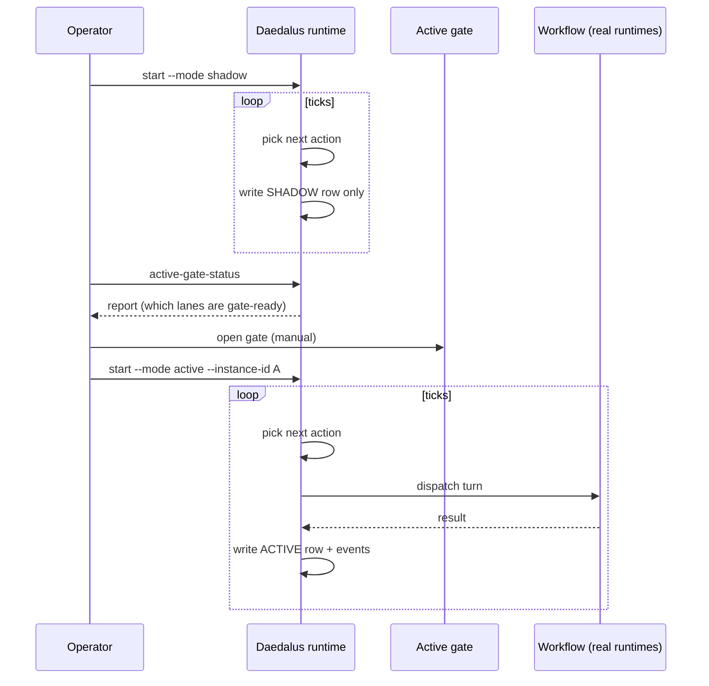

# Shadow → active

Daedalus runs in one of two modes per instance. **Shadow** observes — it ticks, picks lanes, evaluates "what would happen next" — and writes to a separate shadow action queue. **Active** does the same evaluation but actually executes the next action against the real runtime.

The promotion from shadow to active is gated by `active-gate-status` — an explicit operator step, not a config edit.

## Mode comparison

| | Shadow | Active |
|---|---|---|
| Reads workflow state | ✅ | ✅ |
| Picks next action | ✅ | ✅ |
| Writes shadow rows | ✅ | ❌ |
| Writes active rows | ❌ | ✅ |
| Calls runtimes | ❌ | ✅ |
| Affects GitHub | ❌ | ✅ (comments, merges) |
| Holds leases | ✅ (shadow leases) | ✅ (active leases) |

## Why two modes

The shadow path exists so you can:

- Stand up a new instance against a live workspace and watch it for a day before promoting it.
- Diff "what would shadow do" vs "what active actually did" to catch policy regressions.
- Keep a passive observer running for alerting (`alerts.py`) without having two writers fight.

## Promotion sequence

## Operator commands that touch this

- `runtime.py active-gate-status` — what's blocking promotion
- `runtime.py iterate-shadow` / `iterate-active` — single tick in either mode
- `runtime.py run-shadow` / `run-active` — long-running supervised loop
- `/daedalus shadow-report` — diff between shadow plan and active reality

## Where this lives in code

- Mode selection: `runtime.py` (look for `Mode`, `iterate_shadow`, `iterate_active`)
- Active gate: `runtime.py::active_gate_status`
- Service supervision: `tools.py` (systemd helpers)
- Shadow reporting: `formatters.py::format_shadow_report`
