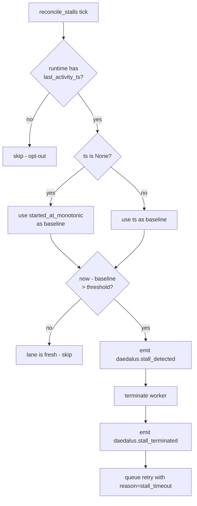

# Stall detection

Symphony §8.5. A wedged worker that's still holding a lease but producing no signal will eventually be terminated by the reconciler, and the lane gets queued for retry.

## The two signals

A stall is detected from two sides:

1. **Liveness** — `Runtime.last_activity_ts()` returns a monotonic timestamp the runtime *most recently* updated. Each adapter calls `_record_activity()` **before** the blocking `_run()` and again after, so a long invocation isn't classified as idle mid-flight.
2. **Threshold** — `stall.timeout_ms` in `WORKFLOW.md` (default 300 000 ms = 5 minutes). Anything older than that is considered stalled.

If a runtime *doesn't* implement `last_activity_ts`, the reconciler skips it entirely. That's the explicit opt-out — never fall back to `started_at_monotonic`, because every long-running adapter would look stalled forever.

## Decision flow



## Schema

```yaml
stall:
  timeout_ms: 600000   # 10 minutes
```

| Field | Type | Default | Notes |
|---|---|---|---|
| `stall.timeout_ms` | int ≥ 0 | `300000` | `0` disables stall detection entirely. Negative values fail schema validation. |

## What gets emitted

| Event | When |
|---|---|
| `daedalus.stall_detected` | The reconciler decides to terminate. |
| `daedalus.stall_terminated` | The worker has been asked to stop and the lane is queued for retry. |

The retry reason is always `stall_timeout` so it's distinguishable from regular failure-induced retries in audit logs.

## Where this lives in code

- Pure decision function: `daedalus/workflows/code_review/stall.py::reconcile_stalls`
- Runtime hook: `Runtime.last_activity_ts()` — see [runtimes.md](runtimes.md)
- Tick wiring: `daedalus/watch.py::reconcile_stalls_tick`
- Schema: `daedalus/workflows/code_review/schema.yaml`
- Tests: `tests/test_stall_detection.py`
